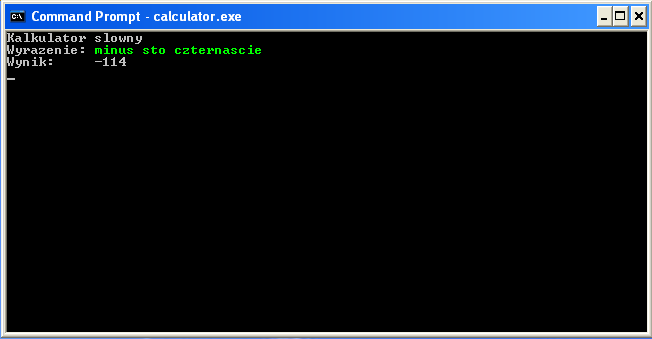
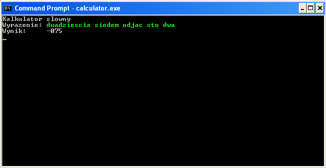
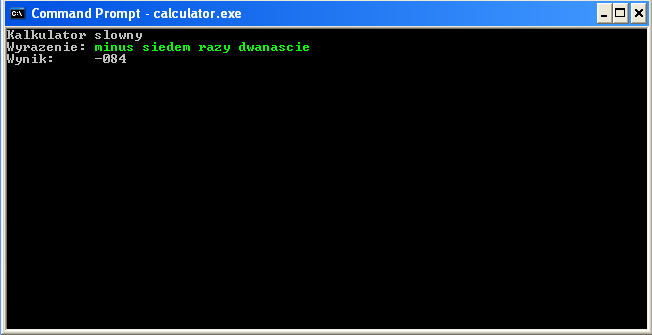
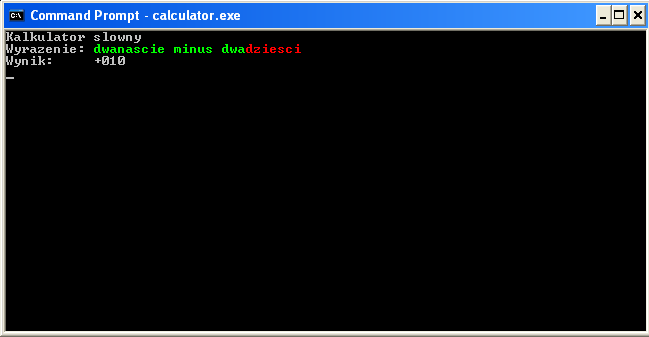
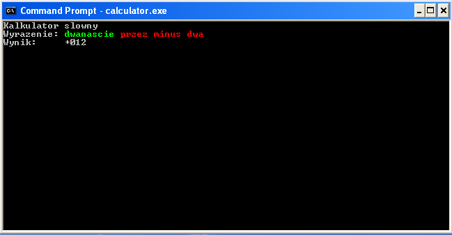
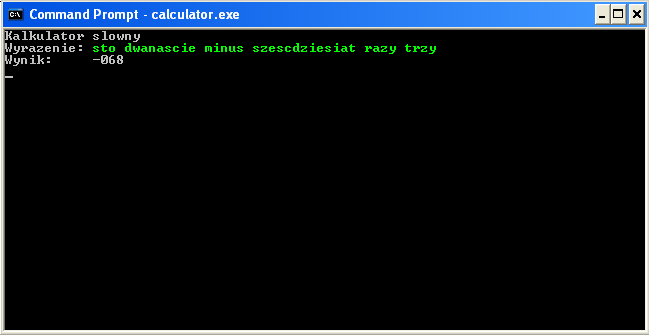
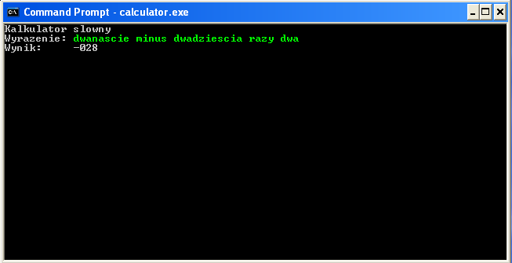
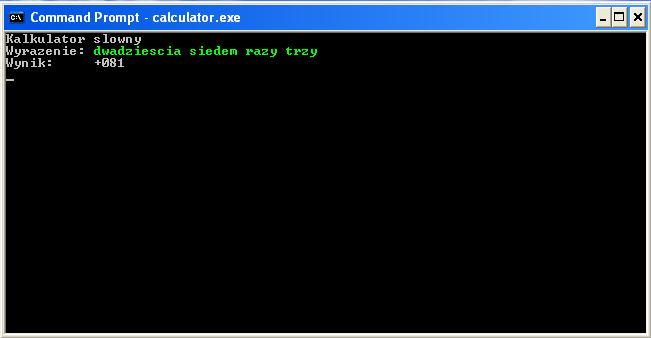

#AGH-ASM
Source code from laboratories of assembler course.

##For pass this course, I had to prepare two miniprojects in the Assembly language (MASM dialect):

1. Simple verbal calculator.

    A calculator should provide three operations on integers: addition, substraction and multiplication;
    and range of input operands = [0, 9].

1. Simple Windows Bitmap viewer.

    A viever should provide ability to load 24-bit and 256-color bitmaps, with small resolution.
    You should use arrow keys to move over whole bitmap and + and - keys to zoom the view.

##My completion of these tasks.

1. Simple verbal calculator.

    I write code of calculator program which features are:
    * three operations on integers number (basic assumption)
    * range of input operands = [-120, 120]
    * real-time parser with syntax inspection
    * ability to enter complex expressions

    After run the application, in two rows are displaying: user input and output result of entered expression (via Arabic numbers). If entered expression is markered with green color then this part of expression is currently included to final result. If some expression is markered with red color then this part of expression has errors and is excluded from final result.

    Calculator know only Polish and only expression entered in Polish can be parsered.

    Some example expressions:
    
    
    
    Right long numbers parsing.
    
    
    
    
    
    Right simple expression parsing.
    
    
    
    
    
    Some errors in expression (not typed correctly or an operation not defined).
    
    
    
    
    
    
    
    Some errors in expression (not typed correctly or an operation not defined).
    